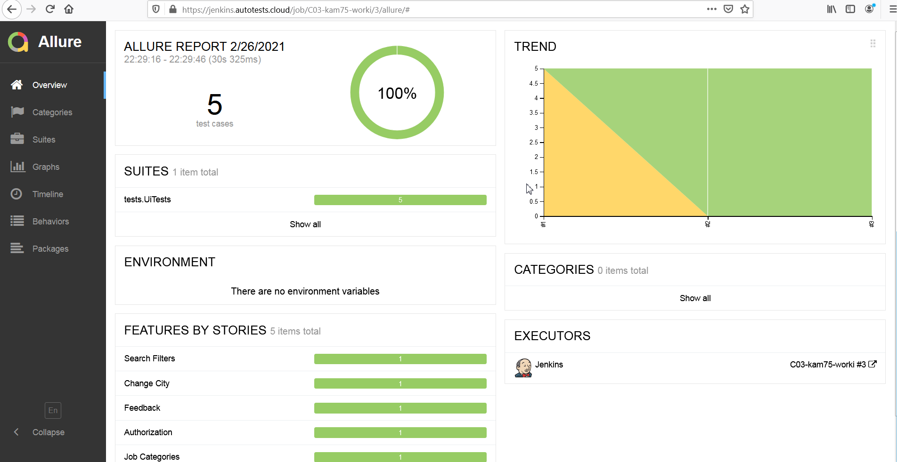
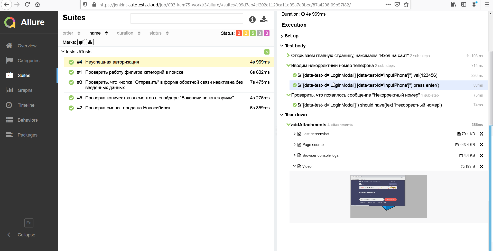
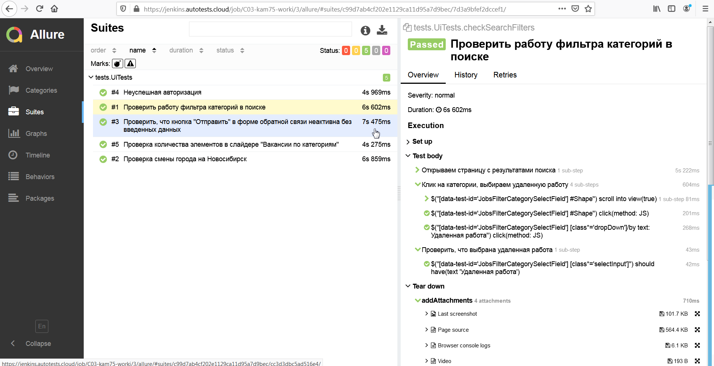
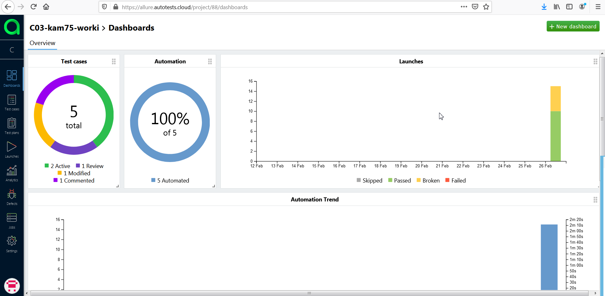
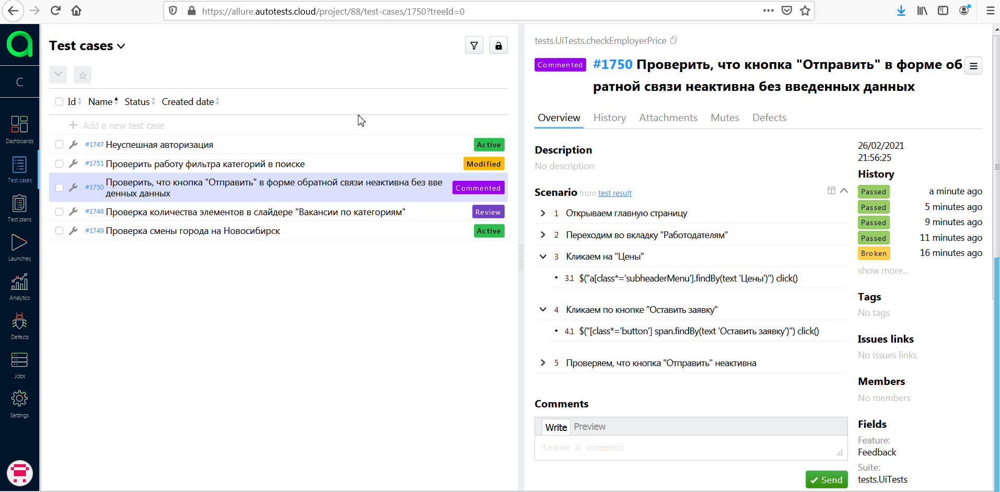
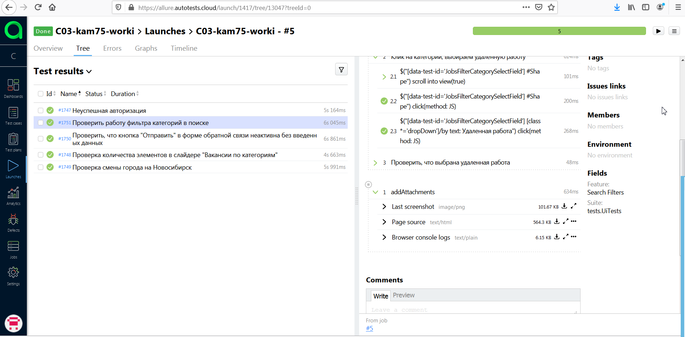
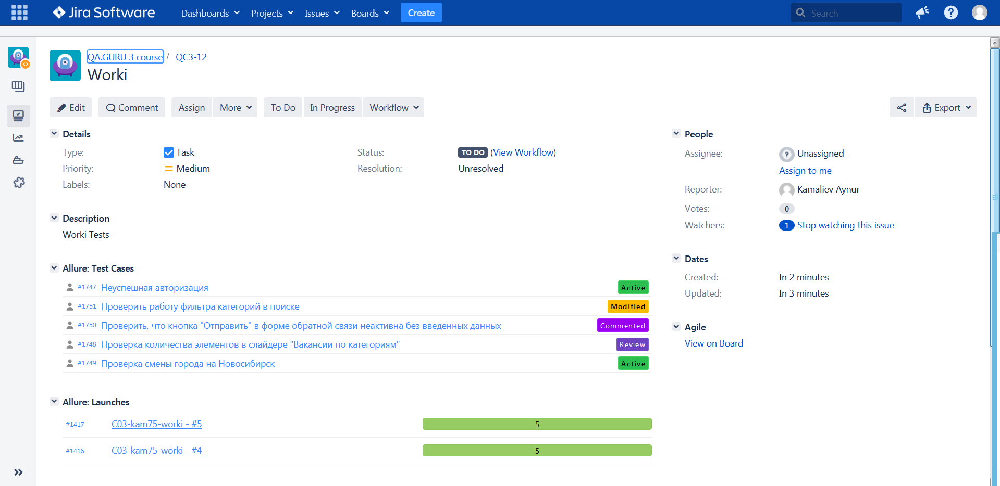
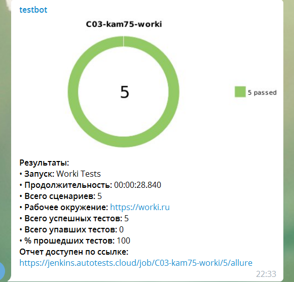

# worki.ru tests
## Использованные инструменты:
* Java
* Gradle
* JUnit5
* Owner
* Selenide
* Jenkins
* Selenoid
* Allure Report
* Allure TestOps (EE)
* Telegram Notifications
* Jira

## Скриншоты
***
Запуск тестов организован в Jenkins. Посмотреть можно по ссылке https://jenkins.autotests.cloud/job/C03-kam75-worki/  
Тесты могут запускаться параллельно.
***
### Allure Report 
***
Отчет о прохождении тестов Allure Report можно посмотреть по ссылке https://jenkins.autotests.cloud/job/C03-kam75-worki/3/allure/
***

### Selenoid
***
Для контейнеризации тестов использован Selenoid.
***

### Allure TestOps (EE) 
***
В качестве системы управления тестами использован Allure TestOps.  
***

### Jira
***
Создана задача в Jira. К ней добавлены тест-кейсты, информация о запусках тестов.
***

***
### Telegram Notifications
***
После окончания тестов результаты отправляются в Telegram
***

